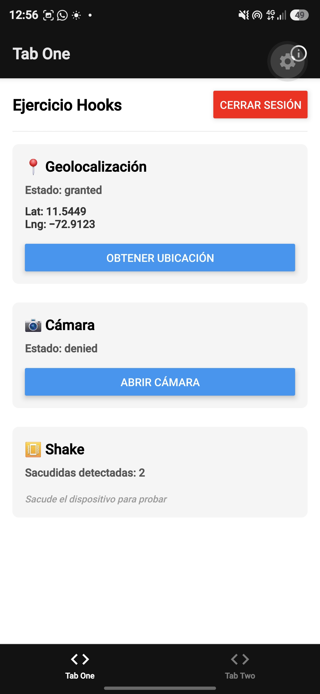
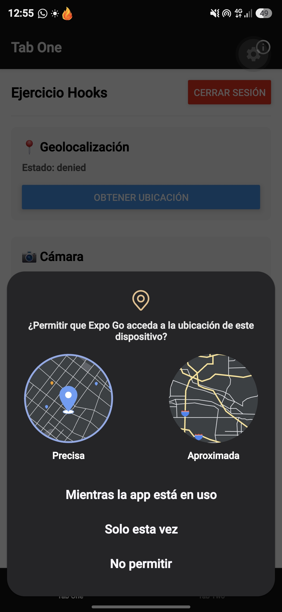
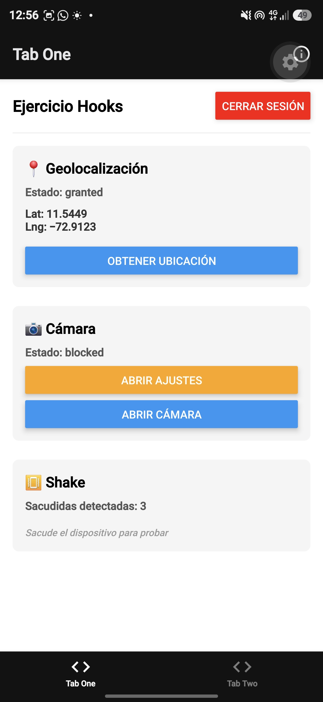

# Ejercicio-Hooks1 — Custom Hooks con Manejo de Permisos

Proyecto de la Semana 6 desarrollado en React Native con Expo. Implementa tres Custom Hooks nativos para el manejo de permisos (ubicación, cámara y sensor de movimiento), además de un sistema de autenticación con login tradicional y biometría.

## 📋 Descripción general

La aplicación permite al usuario:
- Iniciar sesión con email y contraseña.
- Autenticarse con biometría (Face ID o huella dactilar) después del primer login.
- Acceder a la pantalla principal donde puede:
  - Obtener su ubicación actual.
  - Abrir la cámara.
  - Detectar sacudidas del dispositivo (shake).
- Manejar correctamente los tres estados de permiso: concedido, rechazado y bloqueado.

## 🪝 Custom Hooks implementados

| Hook | Descripción |
|------|-------------|
| `useGeoLocation` | Maneja permisos de ubicación y obtiene las coordenadas actuales. |
| `useCamera` | Maneja permisos de cámara y expone el estado de disponibilidad. |
| `useShake` | Detecta sacudidas usando el acelerómetro con limpieza automática. |
| `useBiometricAuth` | Verifica disponibilidad biométrica y autentica al usuario. |

## 📸 Capturas de pantalla

### 📍 Ubicación — Permiso concedido

### 📍 Ubicación — Permiso rechazado

### 📷 Cámara — Permiso bloqueado (con botón "Abrir Ajustes")

## ✅ Verificación de requisitos

- ✅ **La app pide permisos en contexto**, nunca al abrirse: los permisos se solicitan al presionar el botón correspondiente.
- ✅ **Si niegas la ubicación, la cámara sigue funcionando** y la app lo comunica de forma independiente.
- ✅ **Existe un botón "Abrir Ajustes"** cuando el permiso está bloqueado, tanto para ubicación como para cámara.
- ✅ **Todas las suscripciones (GPS, acelerómetro) se limpian al salir de la pantalla** mediante las funciones de cleanup en los `useEffect`.
- ✅ **Los hooks están tipados, sin `any`**, y los errores llegan a la UI como estado.

**CREDENCIALES**
Email:      usuario@test.com
Contraseña: 123456